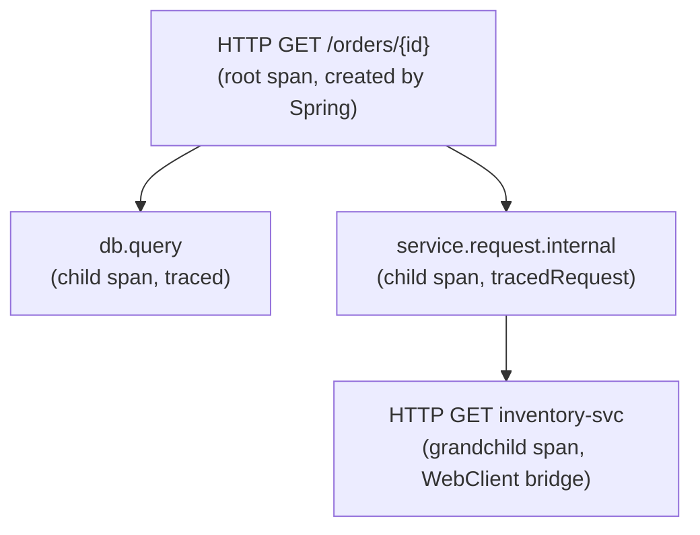

# Metrics Commons

[](https://www.apache.org/licenses/LICENSE-2.0)
[](https://mvnrepository.com/artifact/group.phorus/metrics-commons)

Kotlin extension functions for [Micrometer](https://micrometer.io/) that make metrics and distributed tracing
comfortable to use in backend services. The library wraps the verbose builder/register/record pattern into
single function calls with sensible defaults, and enforces tag safety to prevent cardinality problems before
they reach production.

### Notes

> The project runs a vulnerability analysis pipeline regularly,
> any found vulnerabilities will be fixed as soon as possible.

> The project dependencies are being regularly updated by [Renovate](https://github.com/phorus-group/renovate).
> Dependency updates that don't break tests will be automatically deployed with an updated patch version.

> The project has been thoroughly tested to ensure that it is safe to use in a production environment.
> Currently, there are more than 100 tests validating all the functionality.

## Table of contents

- [Background: why monitoring matters](#background-why-monitoring-matters)
  - [Metrics](#metrics)
  - [Distributed tracing](#distributed-tracing)
  - [How they work together](#how-they-work-together)
- [Cardinality](#cardinality)
- [Features](#features)
- [Getting started](#getting-started)
  - [Installation](#installation)
  - [Tracing bridge setup](#tracing-bridge-setup)
- [Standard metric names](#standard-metric-names)
- [Standard tag names](#standard-tag-names)
- [Metrics API](#metrics-api)
  - [Counters](#counters)
  - [Timers](#timers)
  - [Distribution summaries](#distribution-summaries)
  - [Gauges](#gauges)
- [Tracing API](#tracing-api)
  - [Basic tracing](#basic-tracing)
  - [Request tracing](#request-tracing)
  - [Suspend functions and coroutines](#suspend-functions-and-coroutines)
  - [Span tag utilities](#span-tag-utilities)
  - [Cross-service context propagation](#cross-service-context-propagation)
- [Tag safety utilities](#tag-safety-utilities)
- [When to use which function](#when-to-use-which-function)
- [ThreadLocal, coroutines, and WebFlux](#threadlocal-coroutines-and-webflux)
- [SLO bucket presets](#slo-bucket-presets)
- [Building and contributing](#building-and-contributing)
- [Authors and acknowledgment](#authors-and-acknowledgment)

***

## Background: why monitoring matters

If you are already familiar with metrics and distributed tracing, feel free to skip to [Features](#features).

### Metrics

A metric is a numeric measurement recorded over time. When your service handles a request, you might want to
know how many requests it received, how long they took, how many failed, or how many items are sitting in a
queue right now. Metrics answer these questions by recording numbers that a monitoring backend
(Prometheus, Datadog, Grafana Mimir, etc.) scrapes periodically and stores as time series.

There are four fundamental metric types:

| Type | What it tracks | Example |
|------|----------------|---------|
| **Counter** | A value that only goes up | Total requests served, total errors |
| **Timer** | How long something took | HTTP request latency, database query duration |
| **Distribution summary** | The distribution of non-time values | Request payload sizes, file upload sizes |
| **Gauge** | A point-in-time value that can go up or down | Active connections, cache size, queue depth |

Each metric has a **name** (e.g. `http.server.requests`) and zero or more **tags** (key-value pairs like
`method=GET`, `status=200`). Tags allow you to slice and filter in dashboards.

### Distributed tracing

In a microservice architecture, a single user action can trigger a chain of
calls across many services. When something goes wrong or is slow, you need to know *where* in
that chain the problem is.

Distributed tracing solves this by assigning a unique **trace ID** to each user action and propagating it
through every service call. Each unit of work within a trace is called a **span**. Spans record:

- A **name** describing the operation (e.g. `db.query`, `http.client.call`)
- A **start time** and **duration**
- **Tags** with contextual information (e.g. `source=order-service`, `target=inventory-service`)
- An optional **error** if something went wrong
- A **parent span ID** that links it to the calling span

A trace backend (Grafana Tempo, Jaeger, Zipkin) collects these spans and reassembles them into a visual
timeline, so you can see exactly which service call is slow or failing.

### How they work together

Metrics tell you *that* something is wrong (error rate spiked, latency increased). Traces tell you *where*
and *why* (the payment service is timing out on database queries). In practice, you use metrics for alerting
and dashboards, and traces for debugging specific incidents.

This library provides helpers for both, using [Micrometer](https://micrometer.io/) as the abstraction layer
for metrics and [Micrometer Tracing](https://docs.micrometer.io/tracing/reference/) for distributed tracing.
Both are vendor-neutral facades: you write your instrumentation code once, and the actual backend
(Prometheus, Tempo, Zipkin, Datadog, etc.) is determined by which bridge dependency you add.

## Cardinality

Every unique combination of metric name + tag values creates a separate time series in your monitoring backend.
If you tag a counter with a raw user ID, you get one time series *per user*. With a million users, that is a
million time series for a single metric. This is called **high cardinality**, and it causes:

- **Memory exhaustion** in the monitoring backend
- **Slow dashboard queries** that time out or return incomplete data
- **Increased storage costs** that grow linearly with your user base

The same problem applies to span tags in tracing backends.

This library provides [tag safety utilities](#tag-safety-utilities) that prevent high cardinality by design.
They are used internally by the counter, timer, and tracing functions, and are also available for direct
use when you need to tag metrics or spans manually.

## Features

**Metrics:**
- Increment counters with `count`, `countBy`, `countRequest`, `countRetry`, `countStatus`
- Time synchronous and suspend blocks with `timed`, `timedSuspend`, `timedRequest`, `timedRequestSuspend`
- Record pre-measured durations with `recordDuration`
- Track value distributions with `recordValue`, `recordValueWithPercentiles`, `recordValueWithBuckets`
- Register gauges with `trackGauge`, `trackCollectionSize`, `trackMapSize`

**Tracing:**
- Trace synchronous and suspend blocks with `traced`, `tracedSuspend`, `tracedRequest`, `tracedRequestSuspend`
- Sanitize span tags with `tagSafe` and `tagBounded`

**Cross-cutting:**
- Built-in tag safety to prevent cardinality explosion
- Consistent `source`/`target`/`type`/`uri` tag schema across request counters, timers, and traces
- Predefined SLO bucket presets for common latency profiles
- Full support for Kotlin coroutines (`suspend` variants for all timing and tracing functions)
- All functions are extension functions on `MeterRegistry` or `Tracer`, so they are discoverable via IDE autocomplete

## Getting started

### Installation

Make sure that `mavenCentral` (or any of its mirrors) is added to the repository list of the project.

Binaries and dependency information for Maven and Gradle can be found at [http://search.maven.org](https://search.maven.org/search?q=g:group.phorus%20AND%20a:metrics-commons).

<details open>
<summary>Gradle / Kotlin DSL</summary>

```kotlin
implementation("group.phorus:metrics-commons:x.y.z")
```
</details>

<details open>
<summary>Maven</summary>

```xml
<dependency>
    <groupId>group.phorus</groupId>
    <artifactId>metrics-commons</artifactId>
    <version>x.y.z</version>
</dependency>
```
</details>

The library transitively brings in `io.micrometer:micrometer-registry-prometheus` and
`io.micrometer:micrometer-tracing`. No additional dependencies are needed for metrics.

### Tracing bridge setup

The tracing API depends only on the Micrometer Tracing facade. For spans to actually be collected and
exported, the consuming project must add a **bridge** and an **exporter** matching its tracing backend.

<details open>
<summary>OpenTelemetry (Grafana Tempo, Jaeger)</summary>

```kotlin
implementation("io.micrometer:micrometer-tracing-bridge-otel")
implementation("io.opentelemetry:opentelemetry-exporter-otlp")
```

This is the most common setup for modern observability stacks. If you use Grafana Tempo, this is what you need.
</details>

<details open>
<summary>Brave (Zipkin)</summary>

```kotlin
implementation("io.micrometer:micrometer-tracing-bridge-brave")
implementation("io.zipkin.reporter2:zipkin-reporter-brave")
```
</details>

If no bridge is on the classpath, the `Tracer` returns no-op spans. All tracing functions still execute
their blocks normally, with zero overhead.

***

## Standard metric names

To ensure consistency across all services and libraries, use the constants defined in `MetricNames`
instead of hardcoding metric names. This makes cross-service dashboards, queries, and alerts easier
to build because all services use the same naming conventions.

You can read more about the standard metric names in the [Micrometer documentation](https://micrometer.io/docs/concepts#_standard_metric_names).

```kotlin
import group.phorus.metrics.commons.MetricNames

registry.countStatus(
    name = MetricNames.HTTP_SERVER_EXCEPTIONS,
    statusCode = 404,
    "type" to "NotFound",
)
```

**Available constants:**

| Constant | Metric Name | Use Case |
|----------|-------------|----------|
| `HTTP_SERVER_REQUESTS` | `http.server.requests` | Server-side HTTP requests (Spring Boot Actuator standard) |
| `HTTP_SERVER_EXCEPTIONS` | `http.server.exceptions` | Exceptions caught by exception handlers |
| `HTTP_CLIENT_REQUESTS` | `http.client.requests` | Client-side HTTP requests (WebClient, RestTemplate) |
| `HTTP_CLIENT_ERRORS` | `http.client.errors` | HTTP client errors before response received |
| `DATABASE_QUERIES` | `database.queries` | Database query execution |
| `DATABASE_CONNECTIONS` | `database.connections` | Connection pool state (active/idle/waiting) |
| `DATABASE_TRANSACTIONS` | `database.transactions` | Transaction timing and outcome |
| `CACHE_OPERATIONS` | `cache.operations` | Cache hits/misses/puts/evictions |
| `CACHE_SIZE` | `cache.size` | Current cache size (gauge) |
| `MESSAGE_PUBLISHED` | `message.published` | Messages published to queues/topics |
| `MESSAGE_CONSUMED` | `message.consumed` | Messages consumed from queues |
| `MESSAGE_PROCESSING` | `message.processing` | Message processing duration |
| `AUTH_ATTEMPTS` | `auth.attempts` | Authentication attempts (login, token validation) |
| `AUTH_CHECKS` | `auth.checks` | Authorization/permission checks |
| `BUSINESS_EVENTS` | `business.events` | Domain-specific business events |
| `BUSINESS_OPERATIONS` | `business.operations` | Business operation timing and outcome |
| `EXTERNAL_SERVICE_CALLS` | `external.service.calls` | Calls to external services (third-party APIs) |
| `EXTERNAL_SERVICE_ERRORS` | `external.service.errors` | External service call errors |
| `FILE_OPERATIONS` | `file.operations` | File upload/download/delete |
| `STORAGE_SIZE` | `storage.size` | Current storage usage (gauge) |

See `MetricNames.kt` for the complete list with detailed KDoc comments on recommended tags for each metric.

***

## Standard tag names

To ensure consistent tag naming across all services, use the constants defined in `TagNames`
instead of hardcoding tag names.

```kotlin
import group.phorus.metrics.commons.TagNames

registry.count(
    MetricNames.HTTP_SERVER_REQUESTS,
    TagNames.METHOD to "GET",
    TagNames.STATUS_CODE to "200",
)
```

**Commonly used tag names:**

| Category | Tag Constant | Tag Name | Example Values |
|----------|--------------|----------|----------------|
| **HTTP** | `METHOD` | `method` | `"GET"`, `"POST"`, `"PUT"` |
| | `STATUS_CODE` | `status_code` | `"200"`, `"404"`, `"500"` |
| | `STATUS_FAMILY` | `status_family` | `"2xx"`, `"4xx"`, `"5xx"` |
| | `URI` | `uri` | `"/api/users"`, `"/health"` |
| **Services** | `SOURCE` | `source` | `"user-service"`, `"gateway"` |
| | `TARGET` | `target` | `"auth-service"`, `"stripe-api"` |
| | `TYPE` | `type` | `"internal"`, `"external"` |
| **Errors** | `EXCEPTION` | `exception` | `"NullPointerException"`, `"NotFound"` |
| | `ERROR_CODE` | `error_code` | `"VALIDATION_ERROR"`, `"TIMEOUT"` |
| **Database** | `TABLE` | `table` | `"users"`, `"orders"` |
| | `OPERATION` | `operation` | `"SELECT"`, `"INSERT"`, `"UPDATE"` |
| **Cache** | `CACHE_OPERATION` | `cache_operation` | `"hit"`, `"miss"`, `"put"` |
| | `CACHE_NAME` | `cache_name` | `"user_cache"`, `"session_cache"` |
| **General** | `REGION` | `region` | `"us-east-1"`, `"eu-central-1"` |
| | `OUTCOME` | `outcome` | `"success"`, `"failure"`, `"timeout"` |
| | `DIRECTION` | `direction` | `"inbound"`, `"outbound"` |

See `TagNames.kt` for the complete list of 30+ standardized tag names.

***

## Metrics API

All metric functions are extension functions on `MeterRegistry`. In a Spring Boot application, the registry
is autoconfigured and can be injected directly.

### Counters

```kotlin
// Simple counter
registry.count("app.events", "type" to "login", "region" to "eu")

// Counter with custom amount
registry.countBy("app.bytes.transferred", 4096.0, "direction" to "inbound")

// Service-to-service request counter with consistent tag schema
registry.countRequest(
    source = "order-service",
    target = "payment-api",
    type = RequestType.EXTERNAL,
    uri = "/v1/charges",
)

// Retry counter (pair with countRequest to get retry rates)
registry.countRetry(
    source = "order-service",
    target = "payment-api",
    type = RequestType.EXTERNAL,
    attempt = 2,
)

// HTTP status counter with automatic family grouping
registry.countStatus("http.server.responses", 404, "method" to "GET")
// Produces tags: status_family=4xx, status_code=404
```

### Timers

Timer functions wrap a block of code in a `Timer.Sample`, automatically recording the duration and tagging
the result with the exception type (or `"None"` on success). This means every timer metric always has an
`exception` tag, so Prometheus queries don't need to handle its absence.

```kotlin
// Time a synchronous block
val user = registry.timed("db.query", "table" to "users") {
    userRepository.findById(id)
}

// Time a suspend block (for use inside coroutines)
val user = registry.timedSuspend("db.query", "table" to "users") {
    userRepository.findByIdSuspend(id)
}

// Time a service-to-service request with consistent tag schema
val response = registry.timedRequest(
    source = "order-service",
    target = "payment-api",
    type = RequestType.EXTERNAL,
) {
    paymentClient.charge(order)
}

// Record a pre-measured duration (e.g. from a response header)
val elapsed = Duration.between(start, Instant.now())
registry.recordDuration("http.client.duration", elapsed, "target" to "stripe")
```

All timer functions accept an optional `slos` parameter for histogram bucket boundaries. The default is
`SloPresets.API_RESPONSE`. See [SLO bucket presets](#slo-bucket-presets) for the other presets.

### Distribution summaries

Distribution summaries track the distribution of values that are not time-based. Use them for payload sizes,
monetary amounts, queue depths, or any numeric value where you care about the statistical shape rather than
just a running total.

```kotlin
// Simple value recording (count, total, max)
registry.recordValue("app.file_size", 15000.0, "type" to "upload")

// With client-side percentile approximations (p50, p75, p90, p95, p99)
registry.recordValueWithPercentiles("app.response_size", payload.length.toDouble())

// With explicit histogram buckets (aggregatable across instances)
registry.recordValueWithBuckets(
    "app.file_size",
    payload.length.toDouble(),
    "type" to "upload",
    buckets = doubleArrayOf(1024.0, 10_240.0, 102_400.0, 1_048_576.0),
)
```

**Percentiles vs. buckets:** Client-side percentiles (`recordValueWithPercentiles`) are computed locally
and give you quick insight on a single instance, but they cannot be aggregated across multiple instances.
Histogram buckets (`recordValueWithBuckets`) are exported as Prometheus `_bucket` series and *can* be
aggregated, making them the right choice for production dashboards that cover multiple replicas.

### Gauges

Gauges represent a point-in-time value that can go up and down. Unlike counters and timers, you typically
register a gauge once during initialization and let the registry sample it periodically.

All gauge functions return the tracked object so they can be used inline during field initialization.
**Important:** Micrometer holds a `WeakReference` to the state object. The caller must keep a strong
reference (assign it to a field, not a local variable) for the gauge to remain active.

```kotlin
// Track an AtomicInteger
val activeWorkers = AtomicInteger(0)
registry.trackGauge("app.workers.active", activeWorkers)

// Track a custom value function
val cache = CacheBuilder.newBuilder().build<String, User>()
registry.trackGauge("app.cache.size", cache) { it.size().toDouble() }

// Track collection size (shortcut)
private val pendingTasks = registry.trackCollectionSize(
    "app.tasks.pending",
    CopyOnWriteArrayList(),
    "queue" to "default",
)

// Track map size (shortcut)
private val activeSessions = registry.trackMapSize(
    "app.sessions.active",
    ConcurrentHashMap<String, Session>(),
)
```

***

## Tracing API

All tracing functions are extension functions on `Tracer`. In a Spring Boot application with a tracing bridge
on the classpath, the tracer is autoconfigured and can be injected directly.

### Basic tracing

```kotlin
// Trace a synchronous block
val user = tracer.traced("db.query", "table" to "users") { span ->
    val result = userRepository.findById(id)
    span.event("query complete")
    result
}
```

The `traced` function creates a new span, starts it, puts it into ThreadLocal scope (so child spans are
automatically parented), executes the block, and ends the span in a `finally` block. If the block throws,
`Span.error(exception)` is called before re-throwing.

**The `span` parameter:** The block receives the active `Span` object. You can use it to attach additional
context as the operation progresses: `span.event("message")` records a timestamped event inside the span,
`span.tag("key", "value")` adds a tag, and `span.error(exception)` marks the span as failed. These are
optional; if you don't need them, you can ignore the parameter (use `{ ... }` instead of `{ span -> ... }`).

**Nesting under Spring's root span:** Any call to `traced` or `tracedSuspend` inside a request handler
creates a **child span** under the root span that Spring Boot creates for the incoming request (see
[Cross-service context propagation](#cross-service-context-propagation)). You can nest them as deep as you
need:

```kotlin
@GetMapping("/orders/{id}")
fun getOrder(@PathVariable id: String): Order {
    // Child span under the HTTP root span
    val order = tracer.traced("db.query", "table" to "orders") {
        orderRepository.findById(id)
    }
    // Another child span under the HTTP root span
    val enriched = tracer.tracedRequest(
        source = "order-service",
        target = "inventory-service",
        type = RequestType.INTERNAL,
    ) {
        inventoryClient.enrich(order)
    }
    return enriched
}
```

In the trace backend, this produces a tree like:



Each span records its own duration, so you can see exactly how much time was spent on the database query
versus the outgoing HTTP call. This works because all tracing functions call `tracer.nextSpan()`, which
automatically picks up the current parent span and nests the new span under it. See
[ThreadLocal, coroutines, and WebFlux](#threadlocal-coroutines-and-webflux) for how parent lookup works
across synchronous and reactive stacks.

### Request tracing

For service-to-service calls, `tracedRequest` creates a span with the same `source`/`target`/`type`/`uri`
tag schema used by `countRequest` and `timedRequest`. This makes it straightforward to correlate traces with
metrics in dashboards.

```kotlin
val response = tracer.tracedRequest(
    source = "order-service",
    target = "payment-api",
    type = RequestType.EXTERNAL,
    uri = "/v1/charges",
) { span ->
    val result = paymentClient.charge(order)
    span.event("payment charged")
    result
}
```

### Suspend functions and coroutines

Every tracing function has a suspend variant: `tracedSuspend` and `tracedRequestSuspend`.

```kotlin
val user = tracer.tracedSuspend("db.query", "table" to "users") { span ->
    val result = userRepository.findByIdSuspend(id)
    span.event("query complete")
    result
}
```

The suspend variants do **not** set a ThreadLocal scope because coroutines can switch threads at
suspension points. Instead, the span is passed explicitly to the block. For most use cases this is all
you need. See [ThreadLocal, coroutines, and WebFlux](#threadlocal-coroutines-and-webflux) for details on
how parent span lookup works and when you need to pass the parent manually.

### Span tag utilities

The same cardinality problem that affects metrics also affects span tags. Two extension functions on `Span`
help keep span tags safe:

```kotlin
tracer.traced("app.process") { span ->
    // Sanitize null/blank to "None"
    span.tagSafe("user", userName)

    // Restrict to an allowlist, collapse unknown values to "other"
    span.tagBounded("method", request.method, setOf("GET", "POST", "PUT", "DELETE"))
}
```

### Cross-service context propagation

This library creates and manages spans within a single service. Propagating trace context **across** service
boundaries (so that spans from different services appear in the same trace) is handled automatically by the
tracing bridge and your HTTP/messaging framework.

When a tracing bridge is on the classpath, Spring Boot autoconfigures interceptors that:

- **Inject** trace headers (e.g. W3C `traceparent`) into outgoing HTTP requests and Kafka producer records.
- **Extract** trace headers from incoming HTTP requests and Kafka consumer records.

For incoming requests, the bridge also creates a root span automatically. If the request carries a trace
header, the span continues that trace; if it does not, a new trace ID is generated. This happens without
any application code. The functions in this library (`traced`, `tracedRequest`, etc.) are for creating
**additional child spans** within that already-active trace when you need more granular visibility into
specific operations like database queries or outgoing calls.

**Example: tracing an outgoing WebClient call**

With a tracing bridge on the classpath, `WebClient` automatically propagates trace headers. For this to
work, the `WebClient` must be built from the **autoconfigured `WebClient.Builder`** bean (injected by
Spring Boot), not from `WebClient.create()`. Any span active when the call is made becomes the parent of
the downstream service's spans.

The downstream service extracts the header and any spans it creates become children of the same trace.

If you want an **additional local span** with the `source`/`target`/`type`/`uri` tag schema (useful for
correlating with `countRequest`/`timedRequest` metrics), wrap the call in `tracedRequest`:

```kotlin
val response = tracer.tracedRequest(
    source = "order-service",
    target = "inventory-service",
    type = RequestType.INTERNAL,
    uri = "/api/v1/stock",
) {
    webClient.get()
        .uri("http://inventory-service/api/v1/stock/{sku}", sku)
        .retrieve()
        .bodyToMono<StockResponse>()
        .block()
}
```

This is optional. The bridge handles propagation either way; `tracedRequest` just adds a named span for observability.

For Kafka, Spring Kafka supports the same header injection and extraction, but it is **not enabled by
default**. You must set `observationEnabled = true` on the `KafkaTemplate` (producer side) and on
`ContainerProperties` (consumer side). Once enabled, trace headers are injected into `ProducerRecord`
headers and extracted from `ConsumerRecord` headers automatically. On the consumer side, wrapping your
processing logic in `traced` or `tracedSuspend` links it to the producer's trace.

***

## Tag safety utilities

These are top-level functions in `Metrics.kt` that are used internally by the library and also available
for direct use.

| Function | What it does | Example |
|----------|-------------|---------|
| `tagValue(value)` | Trims whitespace, replaces null/blank with `"None"` | `tagValue(null)` → `"None"` |
| `statusFamily(statusCode)` | Groups HTTP codes into families | `statusFamily(404)` → `"4xx"` |
| `exceptionTag(throwable)` | Extracts simple class name | `exceptionTag(e)` → `"TimeoutException"` |
| `boundedTag(value, allowed)` | Restricts to an allowlist | `boundedTag("PATCH", setOf("GET", "POST"))` → `"other"` |

For span tags, use the `Span` extension equivalents: `span.tagSafe(key, value)` and
`span.tagBounded(key, value, allowed)`.

## When to use which function

| I want to... | Use this | File |
|-------------|----------|------|
| Count that something happened | `count` | `Counters.kt` |
| Count with a custom amount | `countBy` | `Counters.kt` |
| Count a service-to-service request | `countRequest` | `Counters.kt` |
| Count a retry attempt | `countRetry` | `Counters.kt` |
| Count an HTTP status code | `countStatus` | `Counters.kt` |
| Time a synchronous block | `timed` | `Timers.kt` |
| Time a suspend block | `timedSuspend` | `Timers.kt` |
| Time a service-to-service request | `timedRequest` / `timedRequestSuspend` | `Timers.kt` |
| Record a pre-measured duration | `recordDuration` | `Timers.kt` |
| Record a non-time value distribution | `recordValue` | `Distributions.kt` |
| Record a distribution with percentiles | `recordValueWithPercentiles` | `Distributions.kt` |
| Record a distribution with histogram buckets | `recordValueWithBuckets` | `Distributions.kt` |
| Track a live value (gauge) | `trackGauge` | `Gauges.kt` |
| Track a collection's size | `trackCollectionSize` | `Gauges.kt` |
| Track a map's size | `trackMapSize` | `Gauges.kt` |
| Trace a synchronous block | `traced` | `Tracing.kt` |
| Trace a suspend block | `tracedSuspend` | `Tracing.kt` |
| Trace a service-to-service request | `tracedRequest` / `tracedRequestSuspend` | `Tracing.kt` |
| Sanitize a span tag | `tagSafe` / `tagBounded` | `Tracing.kt` |

**Combining metrics and traces for service requests:**

In practice, you often want both a metric and a trace for the same request. All tracing functions accept
an optional `registry` parameter. When provided, the function records metrics alongside the span in a
single call, no nesting needed:

```kotlin
val response = tracer.tracedRequest(
    source = "order-service",
    target = "payment-api",
    type = RequestType.EXTERNAL,
    registry = registry,
) { span ->
    paymentClient.charge(order)
}
```

By default, `tracedRequest` records both a timer (equivalent to `timedRequest`) and a counter (equivalent
to `countRequest`) with the same tag schema. Customize via the `metrics` lambda:

```kotlin
// Only record a timer, no counter
tracer.tracedRequest(
    source = "order-service",
    target = "payment-api",
    type = RequestType.EXTERNAL,
    registry = registry,
    metrics = { timed() },  // or timed().counted(), etc.
) { span ->
    paymentClient.charge(order)
}
```

The generic `traced` / `tracedSuspend` functions default to recording a timer with the same name and tags
as the span:

```kotlin
val user = tracer.traced("db.query", "table" to "users", registry = registry) { span ->
    userRepository.findById(id)
}
```

Pass `metrics = {}` to disable metrics even when a registry is provided. The tag schema is consistent
across all functions, so you can always add or remove metrics later without changing your dashboards.

## ThreadLocal, coroutines, and WebFlux

Micrometer Tracing uses `ThreadLocal` internally to track the "current span". This library's tracing
functions handle it differently depending on the variant:

**`traced` / `tracedRequest`** (synchronous): Put the span into a ThreadLocal for the duration of the block.
The block is `(Span) -> R` (not `suspend`), so it runs on one thread and cannot switch mid-execution. Any
nested `tracer.nextSpan()` call will automatically pick up the parent span from the ThreadLocal.

**`tracedSuspend` / `tracedRequestSuspend`** (suspend): Skip the ThreadLocal entirely. The span is passed
explicitly to the block as a parameter, so you always have access to it regardless of thread switches.

**Parent lookup in reactive stacks:** In a Spring WebFlux application with a tracing bridge and the
`context-propagation` library on the classpath (included transitively by Spring Boot 3.2+),
`tracer.nextSpan()` picks up the parent span from Reactor's `Context` automatically. This means
parent-child relationships are preserved even when coroutines or reactive operators switch threads.

**Manual child spans:** If you need to create child spans inside a suspend block and no Reactor `Context`
integration is available (e.g. plain coroutines outside of Spring WebFlux), pass the parent explicitly:

```kotlin
tracer.tracedSuspend("parent.op") { parentSpan ->
    val child = tracer.nextSpan(parentSpan).name("child.op").start()
    try { doWork() } finally { child.end() }
}
```

For most use cases you just run your code inside the block and the received span is all you need. Creating
manual child spans is only necessary when you want to break down a single traced operation into smaller
sub-spans for more granular visibility.

## SLO bucket presets

Timer functions accept an `slos` parameter for histogram bucket boundaries. Three presets are available in
`SloPresets`:

| Preset | Range | Use case |
|--------|-------|----------|
| `API_RESPONSE` (default) | 5ms to 10s | HTTP handlers, gRPC calls, database queries |
| `BACKGROUND_TASK` | 1s to 30min | Scheduled jobs, queue consumers, batch processing |
| `LONG_RUNNING` | 1min to 24h | Data migrations, full reindexing, report generation |

```kotlin
// Use a different preset for a background job
registry.timed("app.batch.process", slos = SloPresets.BACKGROUND_TASK) {
    processBatch()
}

// Or provide your own buckets
registry.timed("app.custom", slos = arrayOf(Duration.ofMillis(100), Duration.ofMillis(500))) {
    doWork()
}
```

## Building and contributing

See [Contributing Guidelines](CONTRIBUTING.md).

## Authors and acknowledgment

- [Martin Ivan Rios](https://linkedin.com/in/ivr2132)
